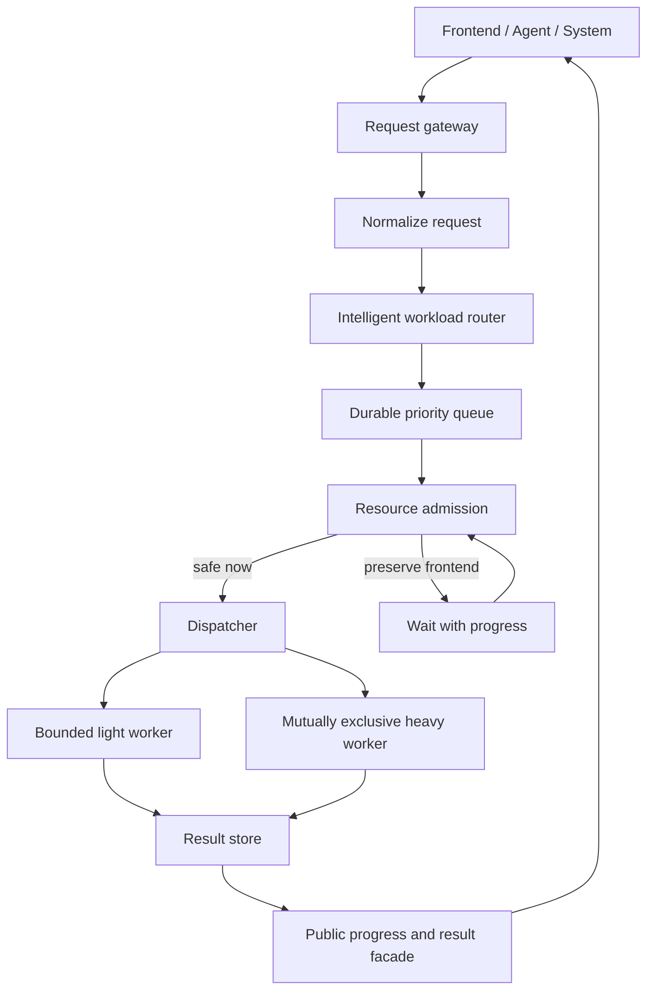

# DataTube Backend Architecture v2

## Product contract

DataTube accepts a research intent and owns every operational decision after
submission. A user or Agent chooses research semantics, not RAM, worker count,
processes, partitions, retries, or queue implementation.

The public contract is:

1. Submission validates and persists a job, then returns immediately.
2. DataTube automatically classifies, estimates, prioritizes, admits, and
   dispatches the job.
3. Read and control requests remain available while compute is queued or
   running.
4. Long-running work always exposes queue position, a semantic phase,
   progress, heartbeat, and whether user action is required.
5. A failed compute worker may fail one job, but must not fail the Web process.

## Control plane and compute plane



The Web process is the control plane. It only validates, persists, reads,
cancels, and reports status. Universe compilation, data loading, factor/alpha
calculation, evaluation, and backtesting belong to isolated compute workers.

## Automatic routing pipeline

Every compute request follows one policy:

```text
normalize -> classify -> estimate -> choose execution mode
          -> assign priority -> persist -> admit -> dispatch -> observe
```

The initial priority classes are:

| Class | Internal priority | Behavior |
| --- | ---: | --- |
| Control and health | P0 | Served directly; never waits behind compute |
| Frontend reads | P1 | Served directly from lightweight stores |
| Agent status/results | P2 | Served directly from lightweight stores |
| Light research | P3 | May pass expensive queued research |
| Heavy research | P4 | Mutually exclusive and bounded |
| Maintenance/batch | P5 | Uses spare capacity only |

Priority is not supplied by the caller. The router derives it from estimated
rows, bytes, universe size, date window, factor/alpha shape, and backtest legs.

## Internal decision versus public response

The router may internally record:

```json
{
  "resource_class": "HEAVY",
  "execution_mode": "BOUNDED_ISOLATED",
  "worker_memory_mb": 8192,
  "estimated_working_set_mb": 4600,
  "priority": 40,
  "dispatch_policy": "WHEN_AVAILABLE"
}
```

Frontend and Agent APIs must expose only the stable product view:

```json
{
  "queue": {
    "state": "WAITING_RESOURCE",
    "position": 2,
    "total": 5,
    "mode": "AUTOMATIC",
    "action_required": false,
    "message": "任务正在等待安全执行窗口，无需手动调整资源。",
    "next_update_seconds": 5
  },
  "progress": {
    "phase": "PREPARING_DATA",
    "percent": 30,
    "action_required": false
  }
}
```

The public facade never asks a Research Agent to select a worker, raise a
memory limit, inspect a PID, manipulate a Manifest, or resubmit blindly.
Engineering inspection retains the full route decision and job-scoped logs.

## Admission and isolation rules

- A frontend memory reserve is subtracted before compute capacity is offered.
- Heavy work is mutually exclusive with other compute launched by the Web
  control plane.
- Standard work has a bounded concurrency limit.
- Each compute tree runs in an isolated child process with memory, runtime,
  log-size, and process-tree limits.
- `MemoryError`, process resource limits, schema failures, and invalid research
  semantics are non-retryable. Transient provider/network failures may use
  bounded exponential backoff.
- A resource wait remains `WAITING_RESOURCE`; it is not a failure and requires
  no user action.

## Execution fallback ladder

The router owns fallback selection:

1. Reuse an exact frozen/cached result when policy permits.
2. Run as bounded isolated light work.
3. Run as mutually exclusive bounded heavy work.
4. Run by partition with checkpoint and resume.
5. Wait for a safe resource window.
6. If the required engine capability does not exist, stop at preflight with a
   non-retryable `SYSTEM_BLOCKED` state before loading data.

Step 6 is a capability boundary, not an instruction for the user to manage
RAM. Repeating the same job cannot be the fallback.

## Streaming and checkpoints

The target research engine processes `partition + warmup`, writes a checkpoint,
and releases memory before the next partition. Checkpoints are keyed by frozen
input identity, engine version, code hash, partition, and phase. Aggregation can
only consume complete, verified checkpoints.

```text
COMPILE_UNIVERSE -> PREPARE_DATA -> PARTITION_2000 -> ... -> PARTITION_2025
                 -> AGGREGATE -> PERSIST -> COMPLETE
```

A restart resumes the first incomplete partition. It must never silently rerun
a non-idempotent completed phase.

## Current implementation status

Implemented now:

- asynchronous Agent experiment submission and history backtest submission;
- separate Experiment orchestration and formal Run dispatch;
- durable queues, leases, heartbeat, restart quarantine, and cancellation;
- frontend memory reserve and resource admission;
- whole-process-tree isolation with time, memory, priority, and log bounds;
- workload estimation before row loading;
- automatic light/heavy research priority and exact-run dispatch;
- automatic backtest worker sizing from workload shape;
- public queue/progress contract with no infrastructure choices;
- fail-fast handling for deterministic resource failures;
- job-scoped durable worker logs.

Still required for the full target state:

- partitioned Arrow/Parquet research execution with warmup windows;
- durable per-phase/per-partition checkpoints and resume;
- compiled point-in-time Universe membership timeline reuse;
- cache-aware routing and result reuse before compute;
- richer live progress sourced from completed partitions instead of coarse
  phase percentages;
- disk and I/O pressure admission in addition to memory/concurrency admission.

Until partition execution is complete, an oversized legacy full-materialization
job is rejected safely at preflight. This prevents another machine-wide OOM but
does not pretend the large experiment has run.

## Non-negotiable rules

1. **No heavy compute in Web.**
2. **No full materialization for large inputs.**
3. **No heavy execution without routing and admission.**
4. **No long-running work without queue, progress, heartbeat, and terminal reason.**
5. **No infrastructure decisions delegated to users or Research Agents.**

