# EventGraph 系统架构用户指南

更新时间：2026-07-04
适用版本：当前 DataTube 本地系统实现
阅读对象：需要理解、使用、排查或指挥外部 agent 更新 EventGraph 的用户

> 这份指南综合了现有文档和源码实现，重点解释系统从“看到新闻/市场”到“形成可审计的核心图谱”的完整路径。它不是给外部 agent 复制执行的 SOP，而是给人理解系统边界、风险和排查方法的说明书。

## 1. 一句话理解 EventGraph

EventGraph 是 DataTube 里的“事件知识图谱系统”：它把 Polymarket 市场、新闻观察、外部 agent 的研究结论和人工审核结果组织成图谱，帮助你看到“事件、金融对象、证据、影响关系、逻辑关系”之间的连接。

最关键的一点是：

**EventGraph 页面看到的很多东西只是系统派生预览，不等于核心事实；只有通过验证、变更请求、审核、应用之后，才会写入 Graph Core。**

这也是为什么系统要分层：

- 派生预览层负责“发现线索”，可以多、快、自动。
- 推理层负责“表达关系”，但必须区分严格逻辑和假设性影响。
- Graph Core 负责“可追溯事实”，必须少、准、可版本回滚。

## 2. 读前地图

如果只想先抓住全局，请记住这张图：

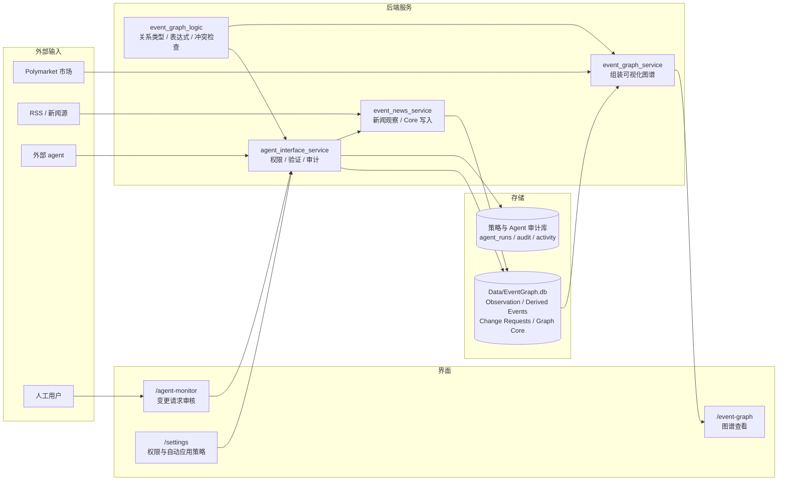

## 原理流程图：先读这一章

EventGraph 最容易被误解成“一组 API”或“一个图页面”。实际上它的核心是一个**信任升级系统**：系统先大量收集不完全可靠的观察，再把观察聚合成候选事件，再让 agent 或人工提出结构化修改，最后只有验证和审核通过的修改才进入 Graph Core。

### A. 信任升级主流程

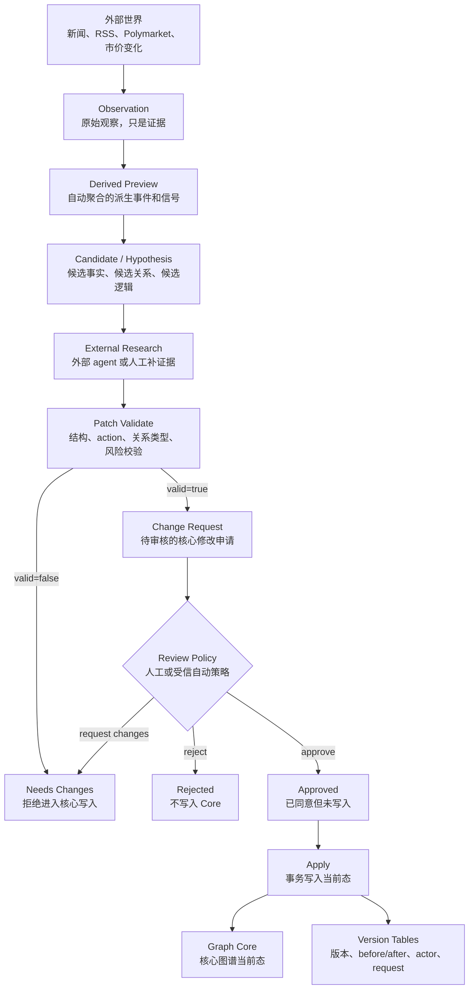

这张图是理解 EventGraph 的钥匙：**Observation 和 Derived Preview 都是“可疑但有用的线索”，Graph Core 才是“系统愿意长期承担的事实状态”。**

### B. 三层信任模型

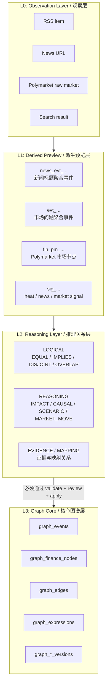

这三层不是页面层级，而是信任层级。页面可以同时展示 L1、L2、L3 的对象，但对象的可信度完全不同。

### C. 读路径：为什么 Core 为空也能看到很多图谱节点

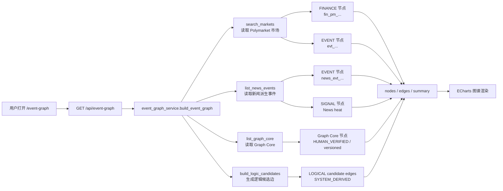

所以 `/event-graph` 不是“Graph Core 浏览器”，而是“研究工作台视图”。它把可探索对象都画出来，帮助你发现值得提交进 Core 的东西。

### D. 写路径：外部 agent 到 Core 的受控通道

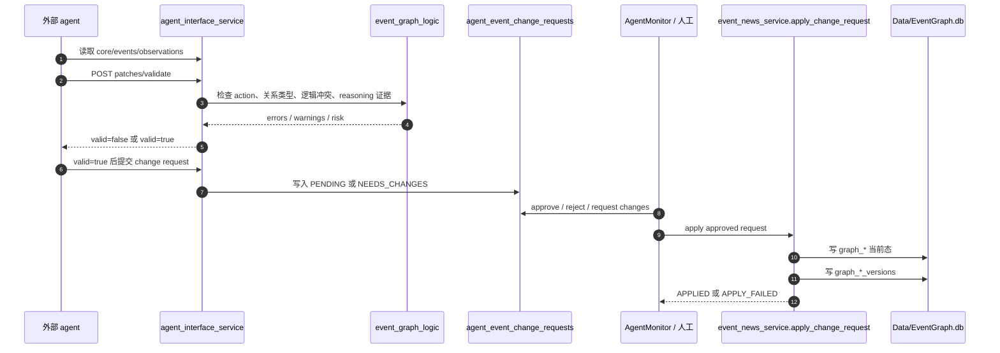

外部 agent 没有“直接写 graph_events”的入口。它能做的是提交一个经过校验、可审计、可拒绝的申请。

### E. Validate 流水线：为什么错误 action 会提前失败

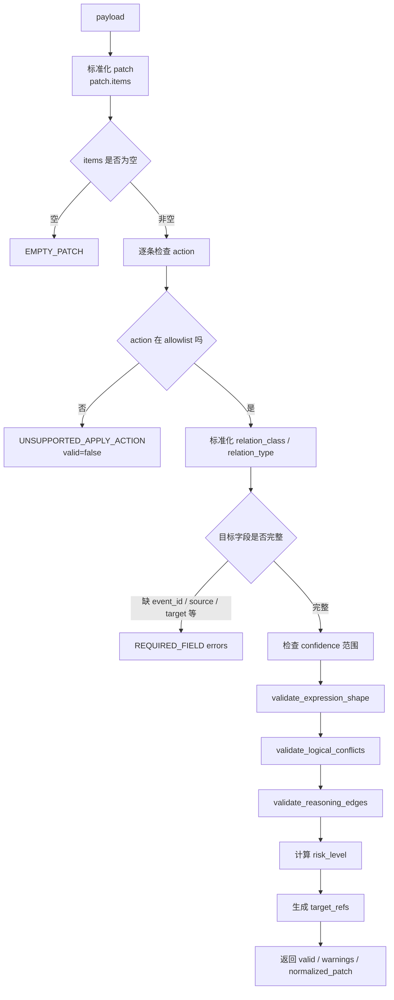

这里有一个重要设计点：`event_promote`、`tag_add` 这类旧式 action 不是“执行时再试试看”，而是在 validate 阶段直接变成 `valid=false`。这样可以避免把无效意图拖到 Core 写入阶段。

### F. Change Request 状态机

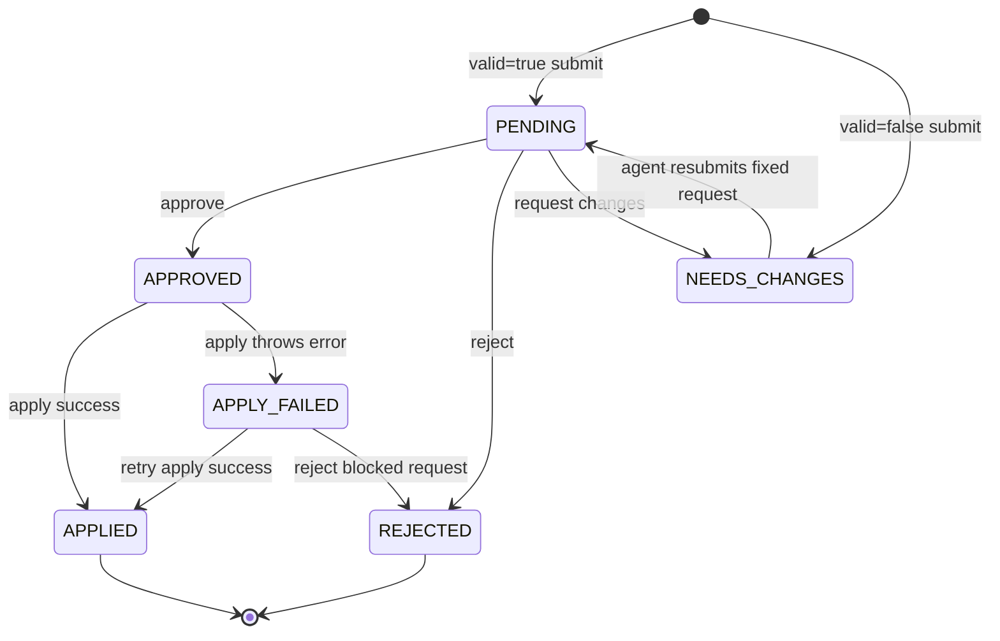

`APPROVED` 不是终点，它只是“允许写入”。真正进入 Core 的状态是 `APPLIED`。

### G. Apply 事务：为什么 Core 有版本历史

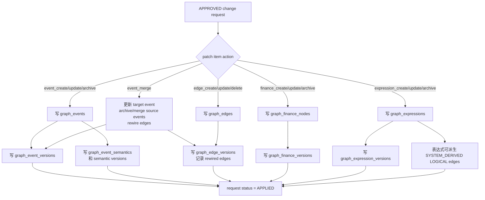

Core 写入不是简单 insert。它会同时记录：

- 当前对象状态。
- 修改前后的版本快照。
- 谁触发修改。
- 来自哪个 request / run。
- patch item 原文。

这就是 Graph Core 和派生预览层的根本差异：Core 是可追责的。

### H. 派生新闻去重原理

你之前看到同名事件，本质上要先判断它们是不是 Graph Core 重复。如果是 `news_evt_...`，通常只是派生新闻层重复。

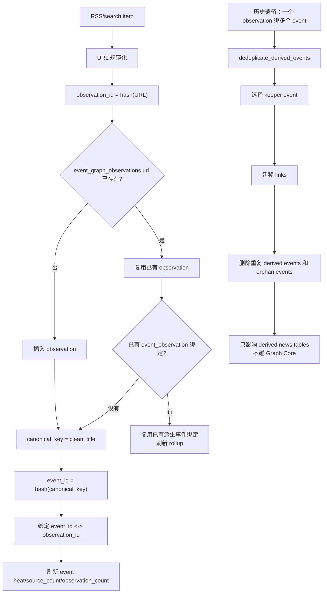

这说明两个重要事实：

- URL 去重解决的是“同一新闻重复入库”。
- derived event dedupe 解决的是“同一个 observation 历史上被多个事件绑定”。

如果重复对象已经在 `graph_events`，那就是 Core 重复，必须用 `event_merge`，不能用新闻 dedupe。

### I. 关系推理决策树

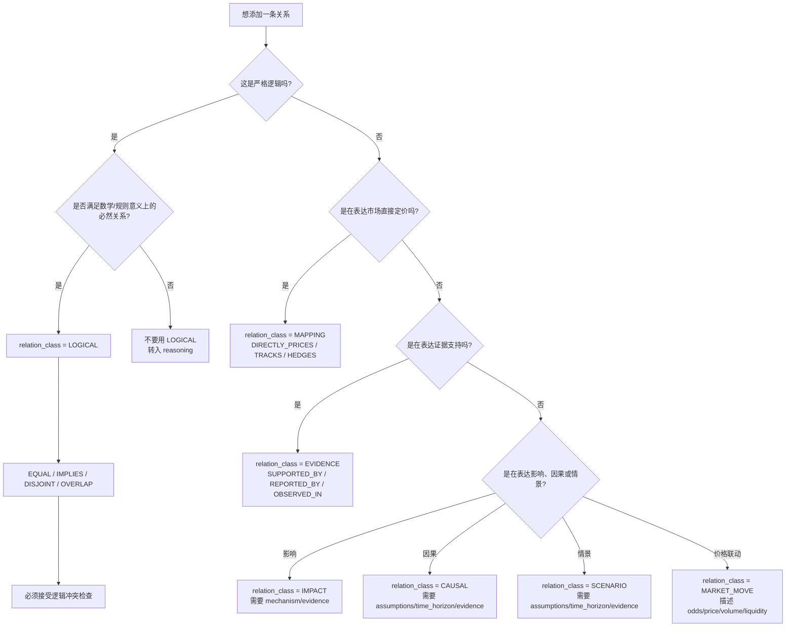

最常见的错误是把“新闻 A 可能导致市场 B 变化”写成 `IMPLIES`。正确做法通常是 `IMPACT` 或 `CAUSAL`，并且要写 mechanism、time horizon、evidence。

### J. 对象关系模型

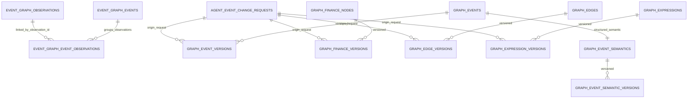

派生新闻事件和 Graph Core 事件没有自动等号关系。把一个 `news_evt_...` 的线索沉淀成 `graph_events`，必须通过 change request。

### K. 一次失败请求到底失败在哪里

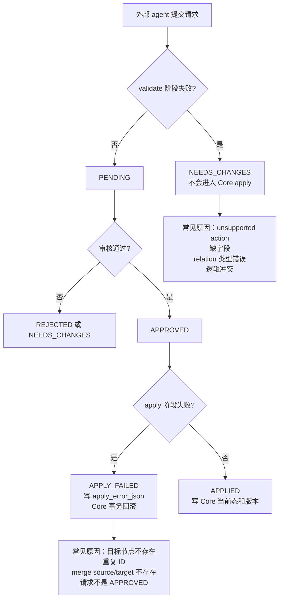

你之前看到 `APPLY_FAILED`，大概率就是请求已经过了“提交/审核”这层，但 action 或目标对象不符合 Core apply 的真实写入条件。现在 validate 已经加了 action allowlist，可以把 `event_promote/tag_add` 这类错误提前拦掉。

### L. 设计原则：为什么系统要这么绕

EventGraph 看起来比“agent 直接写数据库”复杂很多，但这不是为了复杂而复杂，而是为了保护核心图谱。

| 原则 | 含义 | 对应实现 |
|---|---|---|
| 观察和事实分离 | 新闻、搜索结果、市场标题只是观察，不自动成为事实 | `event_graph_observations` 与 `graph_events` 分表 |
| 派生和核心分离 | 自动聚合可以快，核心写入必须慢 | `derived_preview` 与 `Graph Core` 分层 |
| 研究和写入分离 | agent 可以研究和建议，但不能直接改 Core | `patch validate` + `change request` |
| 审核和应用分离 | 批准是人同意，应用才是写入 | `APPROVED` 与 `APPLIED` 分状态 |
| 当前态和历史分离 | 当前图谱要好查，历史要可追责 | `graph_*` 与 `graph_*_versions` |
| 严格逻辑和假设推理分离 | 逻辑边可推导，影响/因果边只能作为假设 | `LOGICAL` 与 `IMPACT/CAUSAL/SCENARIO` |
| 失败早发现 | 明显无效 action 不应进入 apply | `_EVENT_GRAPH_APPLY_ACTIONS` allowlist |
| 去重限定范围 | 派生层重复不能误伤 Core | `deduplicate_derived_events` 只动新闻派生表 |

如果只用一句话概括这些原则：

**EventGraph 允许系统大胆发现，但只允许核心图谱谨慎记账。**

### M. 研究路线：从现象读到源码

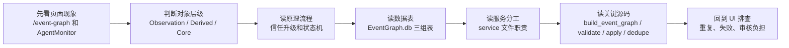

推荐具体顺序：

1. 先读本章 A-K 的流程图，建立心智模型。
2. 再读“系统分层”和“核心对象词典”，搞清楚每个对象属于哪层。
3. 然后读“数据库结构”，把对象落到表上。
4. 再读“后端服务分工”，知道问题该去哪个文件找。
5. 最后读 API 和 patch 示例，因为它们只是系统原则的外部入口。

## 3. 系统分层

EventGraph 可以理解成“一个数据底座 + 三个工作层”。

### 3.1 数据底座：Observation

Observation 是系统看到的原始观察，例如一条新闻 RSS item、一条搜索结果、一条被抓取的市场信息。

它的特点：

- 它是证据，不是结论。
- 新闻 observation 以 URL 去重，`event_graph_observations.url` 有唯一约束。
- 同一条 observation 可以被归到一个派生事件下。
- observation 本身不会变成 Graph Core 事实，除非有人或 agent 基于它提出一个合格的变更请求。

新闻 observation 存在 `Data/EventGraph.db`：

- `event_graph_observations`
- `event_graph_event_observations`
- `event_graph_refresh_runs`

### 3.2 第一层：Derived Preview，派生预览层

这是 `/event-graph` 默认展示的主要内容，返回结果里的 `source` 是 `derived_preview`。

它包含：

- 从 Polymarket 市场自动聚合出的事件节点。
- 从 RSS 新闻自动聚合出的新闻事件节点。
- 从市场标题、规则、成交量、流动性等推出来的热度信号。
- 从结构化 market semantic 推出来的逻辑候选边。
- 已经写入 Graph Core 的对象，也会被混入图中显示，方便对照。

这一层的价值是“发现”，不是“确权”。例如你看到一个标题很像新闻事实的事件，它仍可能只是系统按标题聚合出来的 `SYSTEM_DERIVED` 节点。

典型对象：

- `evt_...`：从 Polymarket 市场分组派生的事件。
- `fin_pm_...`：从 Polymarket condition id 派生的金融/市场节点。
- `news_evt_...`：从新闻标题 canonical key 派生的新闻事件。
- `sig_...`：系统生成的 signal 节点，比如 market heat、news heat。

### 3.3 第二层：Reasoning Layer，推理关系层

EventGraph 不是只存“节点”，更重要的是“节点之间是什么关系”。系统把关系分成两大类：

- 严格逻辑关系：可以参与逻辑推导。
- 推理/影响关系：是因果假设、情景链、市场影响、证据关系，不能当成严格逻辑。

严格逻辑关系只有：

- `EQUAL`
- `IMPLIES`
- `DISJOINT`
- `OVERLAP`

非严格关系分为：

| 关系类 | 用途 | 例子 |
|---|---|---|
| `IMPACT` | 表示影响或相关影响 | `POSITIVE_IMPACT`, `NEGATIVE_IMPACT`, `ASSOCIATED` |
| `CAUSAL` | 表示因果假设或风险通道 | `CAUSES`, `CONTRIBUTES_TO`, `RISK_CHANNEL` |
| `SCENARIO` | 表示情景依赖 | `ASSUMES`, `CONDITIONAL_ON`, `LEADS_TO` |
| `EVIDENCE` | 表示证据支持或反驳 | `REPORTED_BY`, `SUPPORTED_BY`, `CONTRADICTED_BY`, `OBSERVED_IN` |
| `MAPPING` | 表示市场/资产映射 | `DIRECTLY_PRICES`, `TRACKS`, `HEDGES`, `EXPOSED_TO` |
| `MARKET_MOVE` | 表示价格/成交/流动性共同变化 | `ODDS_MOVED_WITH`, `VOLUME_SPIKE_WITH` |

系统会特别防止一种常见错误：把“可能导致、可能影响、新闻相关”写成 `IMPLIES`。`IMPLIES` 只能表达严格逻辑上的蕴含，不是普通因果。

### 3.4 第三层：Graph Core，核心图谱层

Graph Core 是真正的核心知识库。它只接受受控写入：

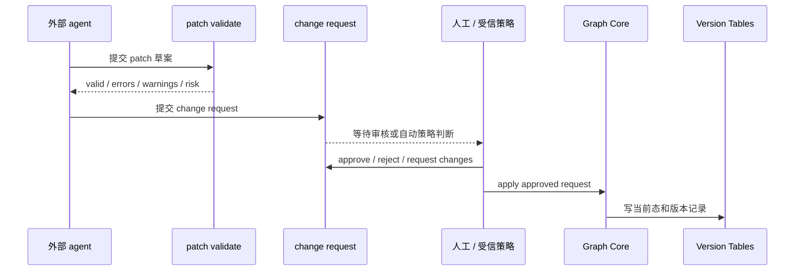

Graph Core 的核心对象：

- `graph_events`：核心事件。
- `graph_event_semantics`：事件的结构化语义。
- `graph_finance_nodes`：核心金融对象、资产、变量、市场等。
- `graph_edges`：核心关系边。
- `graph_expressions`：组合事件或规则表达式。
- `graph_*_versions`：每类对象的版本记录。

Graph Core 为空是正常状态。即使 `/event-graph` 里有几千个派生事件，也不代表核心图谱里已经有几千个事实。

## 4. 核心对象词典

| 名词 | 人话解释 | 是否核心事实 | 主要来源 |
|---|---|---:|---|
| Observation | 一条原始观察，例如新闻 URL | 否 | RSS / search |
| Derived Event | 系统把 observations 或 markets 自动聚合成的事件 | 否 | 新闻 / Polymarket |
| Signal | 热度、市场活动、表达式引用等信号 | 否，除非由 Core expression 派生 | 系统计算 |
| Event | Graph Core 里的核心事件 | 是 | 变更请求应用后 |
| Finance Node | Graph Core 里的金融对象 | 是 | 变更请求应用后 |
| Edge | Graph Core 里的关系边 | 是 | 变更请求应用后 |
| Expression | 组合事件、规则、表达式 | 是 | 变更请求应用后 |
| Change Request | agent 或人工提出的 Core 写入申请 | 待审核对象 | 外部 agent / UI |
| Version | Core 对象每次变化的审计记录 | 是 | apply 时自动写入 |

## 5. 数据库结构

EventGraph 主体数据在：

```text
Data/EventGraph.db
```

它里面有三组表。

### 5.1 新闻与派生事件表

| 表 | 用途 |
|---|---|
| `event_graph_observations` | 新闻 observation。URL 唯一。 |
| `event_graph_events` | 新闻派生事件。由 canonical title 聚合。 |
| `event_graph_event_observations` | 派生事件和 observation 的绑定关系。 |
| `event_graph_refresh_runs` | 每次刷新或搜索新闻的运行记录。 |

注意：这些表属于派生/观察层，不属于 Graph Core。

### 5.2 变更请求表

| 表 | 用途 |
|---|---|
| `agent_event_change_requests` | 外部 agent 或 UI 提交的 EventGraph 变更请求。 |

关键字段：

- `status`：`PENDING`, `NEEDS_CHANGES`, `APPROVED`, `APPLIED`, `APPLY_FAILED` 等。
- `patch_json`：真正准备写入 Core 的 patch items。
- `validation_json`：validate 的结果，包含 errors、warnings、risk。
- `apply_error_json`：应用失败时的错误信息。
- `target_refs_json`：这个请求涉及哪些事件、finance、edge、observation。

### 5.3 Graph Core 表

| 表 | 用途 |
|---|---|
| `graph_events` | 核心事件当前态。 |
| `graph_event_semantics` | 核心事件结构化语义。 |
| `graph_finance_nodes` | 核心金融对象当前态。 |
| `graph_edges` | 核心关系边当前态。 |
| `graph_expressions` | 核心表达式当前态。 |
| `graph_event_versions` | event 版本历史。 |
| `graph_event_semantic_versions` | event semantic 版本历史。 |
| `graph_finance_versions` | finance 版本历史。 |
| `graph_edge_versions` | edge 版本历史。 |
| `graph_expression_versions` | expression 版本历史。 |

每次 apply 都会写当前态和版本记录，所以你可以追踪“谁、什么时候、通过哪个 request、把什么改成了什么”。

AgentMonitor 的运行审计表不在 `EventGraph.db` 主体里，而是在策略/agent 服务库中，用来记录 agent 调用、活动、审批等运行轨迹。

## 6. 后端服务分工

| 文件 | 职责 |
|---|---|
| `services/event_graph_service.py` | 组装 `/api/event-graph` 返回的可视化图谱，把市场、新闻、Core、logic candidates 混合成 nodes/edges。 |
| `services/event_news_service.py` | 新闻刷新、observation 入库、派生新闻事件去重、change request 存储、Graph Core apply。 |
| `services/event_graph_logic.py` | 关系类型定义、表达式校验、逻辑候选生成、逻辑冲突检查、reasoning edge 检查。 |
| `services/agent_interface_service.py` | agent 权限、patch validate、change request 提交、自动应用策略、审计。 |
| `app.py` | Flask 路由，把 UI/API 暴露出来。 |
| `static/event_graph.js` | EventGraph 页面交互、筛选、ECharts 图渲染、版本历史查看。 |
| `static/agent_monitor.js` | AgentMonitor 里的 change request 列表、详情、批准并应用、批量操作。 |

## 7. API 入口（附录式查阅）

这一章只是查表用。真正理解系统时，请先读前面的原理流程图、分层模型、对象模型和写入状态机。API 只是这些原则在 Flask 路由上的表现形式。

### 7.1 人用图谱页面

| 地址 | 用途 |
|---|---|
| `/event-graph` | 图谱主页面。 |
| `/eventgraph` | 同一页面的别名。 |
| `/agent-monitor` | agent 活动、变更请求、审批窗口。 |
| `/settings` | agent 权限和 EventGraph 自动应用策略。 |

### 7.2 图谱读取 API

| API | 用途 |
|---|---|
| `GET /api/event-graph` | 返回可视化图谱。 |
| `GET /api/event-graph/categories` | 返回 Polymarket 分类。 |
| `GET /api/event-graph/events` | 查看新闻派生事件。 |
| `GET /api/event-graph/observations` | 查看新闻 observations。 |
| `GET /api/event-graph/news/status` | 查看新闻层状态、重复 observation、孤儿事件等。 |
| `POST /api/event-graph/news/refresh` | 刷新全局新闻。 |
| `POST /api/event-graph/news/search` | 按关键词搜索并写入 observations。 |
| `POST /api/event-graph/news/deduplicate` | 清理派生新闻层重复事件。 |

### 7.3 外部 agent 受控入口

| API | 用途 |
|---|---|
| `GET /api/agent/event-graph` | agent 读取图谱。 |
| `GET /api/agent/event-graph/news/status` | agent 读取新闻状态。 |
| `GET /api/agent/event-graph/events` | agent 读取派生事件。 |
| `GET /api/agent/event-graph/observations` | agent 读取 observations。 |
| `POST /api/agent/event-graph/news/refresh` | agent 触发新闻刷新。 |
| `POST /api/agent/event-graph/news/search` | agent 触发新闻搜索。 |
| `POST /api/agent/event-graph/patches/validate` | 验证 patch 是否能进入 Core 流程。 |
| `POST /api/agent/event-graph/change-requests` | 提交 change request。 |
| `GET /api/agent/event-graph/change-requests` | 查看变更请求。 |
| `GET /api/agent/event-graph/core` | 查看 Graph Core 汇总。 |
| `GET /api/agent/event-graph/core/events` | 查看核心事件。 |
| `GET /api/agent/event-graph/core/finance` | 查看核心金融对象。 |
| `GET /api/agent/event-graph/core/edges` | 查看核心边。 |
| `GET /api/agent/event-graph/core/expressions` | 查看核心表达式。 |
| `GET /api/agent/event-graph/core/versions` | 查看 Core 对象版本历史。 |

### 7.4 人工审核入口

| API | 用途 |
|---|---|
| `POST /api/event-graph/change-requests/<id>/approve` | 只批准，不应用。 |
| `POST /api/event-graph/change-requests/<id>/approve-and-apply` | 一步批准并应用。 |
| `POST /api/event-graph/change-requests/<id>/apply` | 应用已经批准的请求。 |
| `POST /api/event-graph/change-requests/<id>/reject` | 拒绝请求。 |
| `POST /api/event-graph/change-requests/<id>/request-changes` | 要求 agent 修改。 |

## 8. 外部 agent 为什么不能直接写 Core

外部 agent 的职责是研究和提出变更，不是直接改核心图谱。

系统这样设计是为了防止三类污染：

- 把新闻标题当成已验证事实。
- 把相关性或因果假设写成严格逻辑。
- 用不存在的 action 或半成品字段写入 Core，造成不可追踪的状态。

所以外部 agent 必须走这条路径：

1. 先读 Graph Core，确认是否已有对象。
2. 再读 observations / derived events，收集证据。
3. 构造 `patch.items`。
4. 调用 `patches/validate`。
5. 只有 `valid=true` 才提交 change request。
6. 等待人工或受信策略批准。
7. 系统 apply 后才写入 Graph Core。

## 9. 当前支持的 Core 写入 action

validate 和 apply 阶段都只支持这一组 action：

| 类别 | action |
|---|---|
| Event | `event_create`, `event_update`, `event_archive`, `event_merge` |
| Finance | `finance_create`, `finance_update`, `finance_archive` |
| Edge | `edge_create`, `edge_update`, `edge_delete`, `finance_mapping_create` |
| Expression | `expression_create`, `expression_update`, `expression_archive` |

明确不要使用这些旧式或伪 action：

- `event_promote`
- `tag_add`
- `observation_link`
- `metadata_update`
- `archive`
- `merge`

如果 patch 里出现不支持的 action，validate 会返回：

```text
valid=false
UNSUPPORTED_APPLY_ACTION
```

这类请求不应该提交；如果已经提交，会进入 `NEEDS_CHANGES` 或应用失败状态，不会污染 Graph Core。

## 10. Patch 示例（附录式查阅）

这一章用于看字段形状，不是系统原理的核心。理解 patch 时要始终记住：patch 不是直接写库命令，而是 change request 的内容，必须经过 validate、review、apply 才可能进入 Graph Core。

### 10.1 创建核心事件

```json
{
  "actor_type": "agent",
  "actor_id": "agent_strategy_assistant",
  "change_type": "event_create",
  "title": "Create verified event",
  "summary": "Create a Graph Core event from verified evidence.",
  "evidence_summary": "Evidence from two independent news observations and one market reference.",
  "patch": {
    "items": [
      {
        "action": "event_create",
        "event_id": "g_evt_example_verified_event",
        "title": "Example verified event",
        "summary": "Human-readable summary of what happened.",
        "event_type": "ATOMIC",
        "time_window_start": "2026-07-04",
        "time_window_end": "2026-07-04",
        "semantic": {
          "subject": "example subject",
          "predicate": "happened",
          "object": "example object",
          "resolution_source": "source URL or rule"
        },
        "evidence_refs": [
          {
            "type": "observation",
            "id": "obs_example"
          }
        ],
        "confidence": 0.78
      }
    ]
  }
}
```

### 10.2 创建影响关系

```json
{
  "actor_type": "agent",
  "actor_id": "agent_strategy_assistant",
  "change_type": "edge_create",
  "title": "Connect event to market impact",
  "evidence_summary": "The relationship is a hypothesis supported by the cited evidence, not strict logic.",
  "patch": {
    "items": [
      {
        "action": "edge_create",
        "source_id": "g_evt_example_verified_event",
        "source_type": "event",
        "target_id": "g_fin_example_asset",
        "target_type": "finance",
        "relation_class": "IMPACT",
        "relation_type": "POSITIVE_IMPACT",
        "mechanism": "Explains why the event may increase market-implied probability.",
        "time_horizon": "1-7 days",
        "confidence": 0.62,
        "evidence_refs": [
          {
            "type": "observation",
            "id": "obs_example"
          }
        ]
      }
    ]
  }
}
```

注意：如果你要表达“这个市场直接定价这个事件”，通常应该用 `relation_class=MAPPING` 和 `relation_type=DIRECTLY_PRICES`。如果只是“新闻可能影响价格”，不要用 `DIRECTLY_PRICES`。

## 11. 审核与应用流程

Change request 有两个动作经常被混淆：

- `approve`：表示人同意这个请求，但还没写 Core。
- `apply`：把已批准请求真正写入 Graph Core。

为了减少操作负担，系统现在提供：

- 单条“批准并应用”。
- 批量“批准并应用”。
- 批量“应用已批准”。
- 对无法应用的请求显示 `apply_error_json` 和 Not applyable 原因。

仍然保留分步 approve/apply，是为了在高风险修改里给人一个停顿点：先确认方向，再决定什么时候写入 Core。

## 12. 自动应用策略

Settings 里有 EventGraph approval mode：

| 模式 | 含义 |
|---|---|
| `manual` | 默认模式。有效请求也要人工批准和应用。 |
| `trusted_low_risk` | 低风险、有效、满足证据要求的请求可自动批准并应用。 |
| `trusted_all` | 更宽松的受信模式，但仍必须 validate 通过。 |

自动应用不是“agent 直写”。它仍然经过：

- action allowlist。
- patch validate。
- risk 计算。
- evidence 要求。
- item 数量限制。
- confidence 检查。
- 审计记录。

当前实现里，逻辑关系和 expression 仍会被判定为需要人工处理，因为它们容易改变系统推理结果。

## 13. 去重机制

你之前看到的“多条同名事件”主要发生在派生新闻层，不是 Graph Core。

新闻层正常路径是：

1. 用 URL 生成 `observation_id`。
2. `event_graph_observations.url` 唯一，重复 URL 不会重复插入 observation。
3. 如果 URL 已存在，并且已经绑定到某个派生事件，系统应复用已有绑定。
4. 如果历史上同一个 observation 被绑定到多个 derived events，就用派生层 dedupe 合并。

去重只操作：

- `event_graph_events`
- `event_graph_event_observations`

不会操作：

- `graph_events`
- `graph_edges`
- `graph_finance_nodes`
- `graph_expressions`

所以它不会污染或合并 Graph Core。

检查状态：

```powershell
Invoke-RestMethod -Uri "http://127.0.0.1:5001/api/event-graph/news/status"
```

先 dry run：

```powershell
Invoke-RestMethod `
  -Method Post `
  -Uri "http://127.0.0.1:5001/api/event-graph/news/deduplicate" `
  -ContentType "application/json" `
  -Body '{"dry_run": true, "limit": 500}'
```

确认后执行：

```powershell
Invoke-RestMethod `
  -Method Post `
  -Uri "http://127.0.0.1:5001/api/event-graph/news/deduplicate" `
  -ContentType "application/json" `
  -Body '{"dry_run": false, "limit": 500}'
```

## 14. EventGraph 页面怎么看

`/event-graph` 是图谱可视化页面。它不是只显示 Graph Core，而是显示一个综合视图。

左侧常用筛选：

- 搜索关键词：如 BTC、Trump、rates。
- 分类：Polymarket category。
- 排序：成交量、流动性等。
- 节点类型：Event、Finance、Signal。
- 关系模式：全部、严格逻辑、reasoning、impact、causal、scenario、mapping、evidence、expression。

中间图谱：

- Event 节点代表事件。
- Finance 节点代表市场、资产、变量或金融对象。
- Signal 节点代表热度、新闻、表达式等系统信号。
- 边的颜色和样式会随 relation class 变化。

右侧详情：

- 当前节点的 summary、source type、verification status。
- 相关边。
- Graph Core 对象的版本历史入口。

你需要特别看 `verification_status`：

- `SYSTEM_DERIVED`：系统派生，不是核心事实。
- `AUTO_COLLECTED`：自动采集。
- `HUMAN_VERIFIED`：核心验证事实。
- `REFERENCE_ONLY`：为了显示关系临时补出的引用节点。

## 15. AgentMonitor 怎么看

`/agent-monitor` 是外部 agent 和人工审核的工作台。

EventGraph 相关区域主要看：

- Change Requests：外部 agent 提交的图谱修改请求。
- status：`PENDING`, `NEEDS_CHANGES`, `APPROVED`, `APPLIED`, `APPLY_FAILED`。
- risk：low / medium / high。
- validation errors / warnings。
- apply error：应用失败的具体错误。
- target refs：请求涉及哪些对象。
- patch items：实际要写入 Core 的变更。

常用操作：

- “批准并应用”：单条请求一次完成。
- “应用”：只对 `APPROVED` 请求生效。
- “拒绝”：明显错误或无效请求。
- “要求修改”：证据不足、关系类型不对、影响范围过大。
- “批量批准并应用”：适合多个已 validate 且无 apply problem 的请求。

## 16. 常见故障排查

### 16.1 为什么出现多条同名事件

先判断在哪一层：

- 如果 ID 是 `news_evt_...`，通常是新闻派生层。
- 如果 ID 是 `evt_...`，通常是 Polymarket 派生层。
- 如果 ID 是 `g_evt_...` 或你自定义的 Core event id，才是 Graph Core。

新闻派生层重复通常来自：

- 历史版本中同一 URL observation 被多个 derived events 绑定。
- 不同新闻源标题相近但 canonical key 不同。
- 搜索写入和全局刷新写入产生相近标题。

处理方式：

1. 查 `/api/event-graph/news/status`。
2. 看 `duplicate_observations` 和 `orphan_events`。
3. dry run `/api/event-graph/news/deduplicate`。
4. apply dedupe。
5. 刷新 `/event-graph`。

如果重复在 Graph Core，则不能用新闻 dedupe，要提交 `event_merge` change request。

### 16.2 为什么 change request 显示 APPLY_FAILED

常见原因：

- patch action 不被 apply 支持。
- `edge_create` 的 source/target 节点不存在于 Graph Core。
- `event_create` 使用了已经存在的 event id。
- `event_update` 或 `event_archive` 找不到目标 event。
- `event_merge` 的 target/source 不在 Graph Core。
- 请求没有先变成 `APPROVED`。
- validate 结果是 `valid=false`。

排查顺序：

1. 打开 AgentMonitor 详情。
2. 看 `validation.errors`。
3. 看 `apply_error_json.message`。
4. 如果是 action 问题，改成支持 action。
5. 如果是节点不存在，先创建 event/finance，再创建 edge。
6. 如果是 merge，确认 target/source 都是 Graph Core event。

### 16.3 为什么 agent 用 `tag_add` 或 `event_promote` 会失败

因为这两个不是当前 Graph Core 支持的 action。

正确思路：

- 想把观察到的新闻变成核心事件：用 `event_create`。
- 想修改核心事件：用 `event_update`。
- 想合并核心事件：用 `event_merge`。
- 想表达标签或分类：目前应放进 event 的 payload/semantic 或另行设计支持 action，不能临时发 `tag_add`。

### 16.4 为什么 Graph Core 是空的，但图谱页面很多节点

这是正常的。

`/event-graph` 默认展示派生预览层。Graph Core 是经过审核后才写入的核心层。系统可以有大量 `SYSTEM_DERIVED` 节点，同时 `graph_events=0`。

### 16.5 为什么一个 edge validate 通过但 apply 失败

validate 主要检查 shape、action、relation class/type、confidence、逻辑冲突和证据提示；apply 会真实查询数据库。

所以可能出现：

- validate 认为格式正确。
- apply 时发现 source node 或 target node 不存在。

解决方式是先创建缺失的 Core event/finance，再创建 edge，或者把多个 create 放在同一个 patch items 中并确保顺序和引用 ID 清楚。

## 17. 用户实际操作建议

### 17.1 只是看图谱

1. 打开 `/event-graph`。
2. 搜索你关心的关键词。
3. 先看高热 Event。
4. 点开节点，看 source type 和 verification status。
5. 如果是 `SYSTEM_DERIVED`，把它当作线索，不要当作事实。

### 17.2 让外部 agent 做研究

给 agent 的目标应该是：

- 先读 Core。
- 再读 observations。
- 给出证据。
- 提交 supported action。
- validate 失败就停止并修正，不要继续提交。

### 17.3 人工审核 change request

审核时按这个顺序：

1. 看 action 是否在支持列表里。
2. 看它改的是 Derived Preview 还是 Graph Core。
3. 看 evidence 是否能支撑 summary。
4. 看 relation class 是否正确。
5. 看 `LOGICAL` 是否真的严格。
6. 看 risk level。
7. 看 apply problem。
8. 对可信请求用“批准并应用”。

### 17.4 做 Core 清理

- 派生新闻层重复：用 `/api/event-graph/news/deduplicate`。
- Graph Core 事件重复：用 `event_merge` change request。
- 错误 Core edge：用 `edge_delete`。
- 错误 Core event：优先 `event_update` 修正；确实不用再 `event_archive`。

## 18. 设计边界

EventGraph 当前不是：

- 自动事实裁判。
- 自动交易系统。
- agent 的自由写库接口。
- 所有新闻标题的长期存档系统。
- 一个把任何“相关性”都写成因果的知识库。

EventGraph 当前是：

- 市场与新闻事件发现器。
- 受控知识图谱写入系统。
- 人工审核和 agent 协作层。
- 可版本追溯的核心事实库。
- 策略研究前的上下文组织工具。

## 19. 源码和文档索引

建议按这个顺序读源码：

1. `文档/03-features/event-graph.md`
   了解 EventGraph 页面、数据流、API 和节点/边概念。

2. `文档/05-decisions/eventgraph-external-agent-write-design.md`
   了解为什么取消内部 agent、改成外部 agent 受控写入。

3. `文档/02-usage/agent-access-guide.md`
   了解外部 agent 能调用哪些能力。

4. `services/event_graph_service.py`
   看 `/api/event-graph` 如何把 Polymarket、新闻、Core、logic candidates 组装成图。

5. `services/event_news_service.py`
   看新闻 observation 入库、derived event 去重、change request、Graph Core apply。

6. `services/event_graph_logic.py`
   看 relation class、expression、逻辑冲突和 reasoning 校验。

7. `services/agent_interface_service.py`
   看 agent capabilities、patch validate、approval policy、auto apply 和审计。

8. `static/event_graph.js`
   看前端如何筛选关系、展示详情和版本历史。

9. `static/agent_monitor.js`
   看变更请求列表、批准并应用、批量操作和错误显示。

## 20. 最后给你的心智模型

把 EventGraph 想成四个角色一起工作：

- **采集器**：不断看到市场和新闻，生成 observations。
- **整理员**：把 observations 聚成 derived events，给你一个可探索预览。
- **研究员**：外部 agent 基于证据提出 Core 修改建议。
- **档案管理员**：系统只把验证过、审核过、可版本追踪的东西写进 Graph Core。

当系统出问题时，先问一个问题：

**问题发生在哪一层？Observation、Derived Preview、Change Request，还是 Graph Core？**

这个问题问清楚，重复事件、失败请求、错误关系、审批操作复杂这些问题都会变得可定位。
